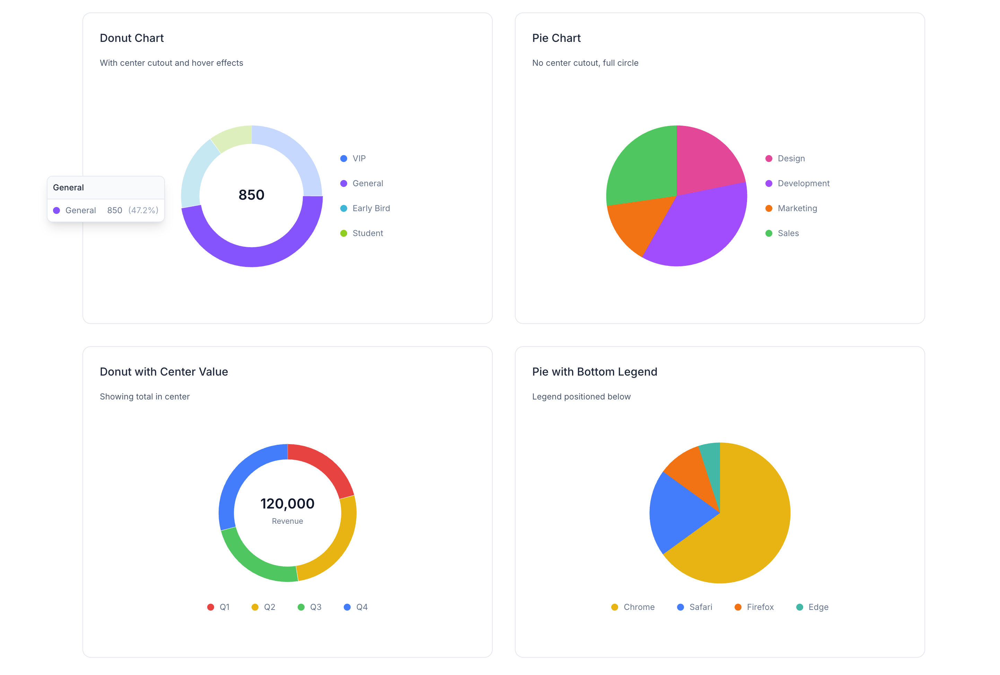
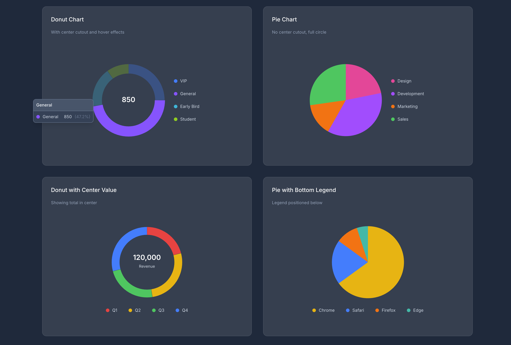

# Radial

Radial is a companion for [Flux UI](https://fluxui.dev), adding donut and pie charts styled to match Flux’s look and feel. Simple to use, with hover effects, legends, and dark mode support.

| Light | Dark |
|-------|------|
|  |  |

## Installation

```bash
composer require jonpurvis/radial
```

## Data Structure

Both components use the same segment format. Each segment requires `label`, `value`, and `class`:

```php
$data = [
    ['label' => 'Critical', 'value' => 40, 'class' => 'text-red-500'],
    ['label' => 'Warning', 'value' => 25, 'class' => 'text-yellow-500'],
    ['label' => 'Healthy', 'value' => 35, 'class' => 'text-green-500'],
];
```

| Key | Type | Description |
|-----|------|-------------|
| `label` | `string` | Segment name (shown in tooltip and, for donut, in center on hover) |
| `value` | `int\|float` | Segment value (determines arc size) |
| `class` | `string` | Tailwind color class for the segment (e.g. `text-blue-500`) |

---

## Donut Component

A radial chart with a number in the center, perfect for dashboards. Segments highlight on hover, showing values in a tooltip and in the center.

### Basic usage

```blade
<radial:donut :data="$data" label="Total" />
```

### Donut – all options

| Prop | Type | Default | Description |
|------|------|---------|-------------|
| `data` | `array` | `[]` | Segments with `label`, `value`, and `class` (Tailwind color) |
| `label` | `string\|null` | `null` | Center label shown below the value |
| `value` | `int\|float\|null` | `null` | Override center value (defaults to sum of data) |
| `hover` | `string\|null` | `null` | Alternative label shown when hovering the center |
| `hoverLabel` | `string\|null` | `null` | Alias for `hover` |
| `legend` | `false\|'top'\|'bottom'\|'left'\|'right'` | `false` | Show legend at specified position |
| `tooltip` | `bool` | `true` | Show tooltip on segment hover |
| `cutout` | `int` | `70` | Inner hole size (0 = solid, 70 = donut, 90 = thin ring) |
| `static` | `bool` | `false` | Disable hover/tap interactions |
| `size` | `string` | `'13rem'` | Chart size (width/height) |

### Donut examples

**Legend on any side**

```blade
<radial:donut :data="$data" legend="bottom" />
<radial:donut :data="$data" legend="top" />
<radial:donut :data="$data" legend="left" />
<radial:donut :data="$data" legend="right" />
```

**Center hover label**

```blade
<radial:donut :data="$data" label="Total" hover="All Categories" />
```

**Thin ring** (`cutout` 90)

```blade
<radial:donut :data="$data" :cutout="90" />
```

**Custom center value**

```blade
<radial:donut :data="$data" :value="85" label="Score" />
```

**Static (no interactions)**

```blade
<radial:donut :data="$data" :static="true" :tooltip="false" />
```

**Sizing** – use the `class` attribute; chart stays square:

```blade
<radial:donut :data="$data" class="size-64" />
<radial:donut :data="$data" class="max-w-xs mx-auto" />
```

---

## Pie Component

A solid pie chart (no center hole). Same data structure as the donut; tooltips and legend work the same way.

### Basic usage

```blade
<radial:pie :data="$data" />
```

### Pie – all options

| Prop | Type | Default | Description |
|------|------|---------|-------------|
| `data` | `array` | `[]` | Segments with `label`, `value`, and `class` (Tailwind color) |
| `legend` | `false\|'top'\|'bottom'\|'left'\|'right'` | `false` | Show legend at specified position |
| `tooltip` | `bool` | `true` | Show tooltip on segment hover |
| `static` | `bool` | `false` | Disable hover/tap interactions |
| `size` | `string` | `'13rem'` | Chart size (width/height) |

### Pie examples

**With legend**

```blade
<radial:pie :data="$data" legend="right" />
```

**Static**

```blade
<radial:pie :data="$data" :static="true" :tooltip="false" />
```

**Sizing**

```blade
<radial:pie :data="$data" class="size-64" />
```

---

## Styling

- Segment colors use the `class` key in each data item (e.g. `text-green-500`).
- Center text (donut) and tooltips use Flux-style zinc colors.
- Full dark mode support.

---

## Copy-paste examples

Drop these into a Flux/Livewire page to try the components.

### Donut – minimal

```blade
@php
    $donutData = [
        ['label' => 'Critical', 'value' => 40, 'class' => 'text-red-500'],
        ['label' => 'Warning', 'value' => 25, 'class' => 'text-yellow-500'],
        ['label' => 'Healthy', 'value' => 35, 'class' => 'text-green-500'],
];
@endphp

<radial:donut :data="$donutData" label="Total" />
```

### Donut – with legend and center hover

```blade
@php
    $donutData = [
        ['label' => 'Critical', 'value' => 40, 'class' => 'text-red-500'],
        ['label' => 'Warning', 'value' => 25, 'class' => 'text-yellow-500'],
        ['label' => 'Healthy', 'value' => 35, 'class' => 'text-green-500'],
];
@endphp

<radial:donut :data="$donutData" label="Total" hover="All items" legend="bottom" />
```

### Pie – minimal

```blade
@php
    $pieData = [
        ['label' => 'A', 'value' => 30, 'class' => 'text-blue-500'],
        ['label' => 'B', 'value' => 50, 'class' => 'text-emerald-500'],
        ['label' => 'C', 'value' => 20, 'class' => 'text-amber-500'],
];
@endphp

<radial:pie :data="$pieData" />
```

### Pie – with legend

```blade
@php
    $pieData = [
        ['label' => 'A', 'value' => 30, 'class' => 'text-blue-500'],
        ['label' => 'B', 'value' => 50, 'class' => 'text-emerald-500'],
        ['label' => 'C', 'value' => 20, 'class' => 'text-amber-500'],
];
@endphp

<radial:pie :data="$pieData" legend="right" />
```

### Side-by-side donut and pie

```blade
@php
    $chartData = [
        ['label' => 'Critical', 'value' => 40, 'class' => 'text-red-500'],
        ['label' => 'Warning', 'value' => 25, 'class' => 'text-yellow-500'],
        ['label' => 'Healthy', 'value' => 35, 'class' => 'text-green-500'],
];
@endphp

<div class="flex flex-wrap gap-8 justify-center items-start">
    <radial:donut :data="$chartData" label="Total" legend="bottom" />
    <radial:pie :data="$chartData" legend="right" />
</div>
```

## Contributing

Contributions are welcome. Please open an issue or pull request on [GitHub](https://github.com/jonpurvis/radial).

## License

MIT
